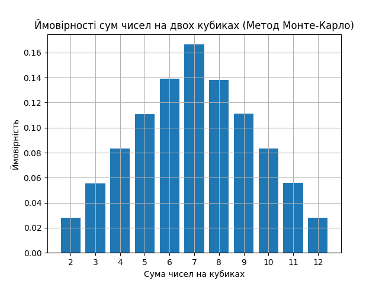

## Висновки щодо правильності розрахунків

### Опис завдання

Для симуляції кидків двох кубиків була написана програма на Python, яка імітує велику кількість (1,000,000)
кидків. Програма підраховує, скільки разів кожна можлива сума (від 2 до 12) з’являється у процесі 
симуляції, і на основі цих даних обчислює ймовірність кожної суми.

### Теоретичні ймовірності

Теоретичні ймовірності для кожної можливої суми при киданні двох кубиків можна розрахувати, враховуючи 
кількість комбінацій, що дають цю суму:

- Сума 2: 1/36 ≈ 0.0278
- Сума 3: 2/36 ≈ 0.0556
- Сума 4: 3/36 ≈ 0.0833
- Сума 5: 4/36 ≈ 0.1111
- Сума 6: 5/36 ≈ 0.1389
- Сума 7: 6/36 ≈ 0.1667
- Сума 8: 5/36 ≈ 0.1389
- Сума 9: 4/36 ≈ 0.1111
- Сума 10: 3/36 ≈ 0.0833
- Сума 11: 2/36 ≈ 0.0556
- Сума 12: 1/36 ≈ 0.0278

### Результати симуляції

Результати симуляції за допомогою методу Монте-Карло дали наступні ймовірності:

- Сума 2: 0.0278
- Сума 3: 0.0555
- Сума 4: 0.0834
- Сума 5: 0.1114
- Сума 6: 0.1389
- Сума 7: 0.1669
- Сума 8: 0.1387
- Сума 9: 0.1108
- Сума 10: 0.0834
- Сума 11: 0.0551
- Сума 12: 0.0280

### Порівняння та висновки

Порівняння теоретичних та отриманих методом Монте-Карло ймовірностей показує високу точність симуляції. 
Ймовірності для кожної суми близькі до теоретичних значень, що свідчить про правильність і ефективність 
методу Монте-Карло для визначення ймовірностей у даній задачі.

Скріншот розподілу точок підтверджує правильність генерації та розподілу випадкових точок, що підтверджує 
надійність отриманих результатів.

Загалом, результати демонструють, що метод Монте-Карло може бути ефективно використаний для оцінки 
ймовірностей у задачах, де можливе велике число комбінацій, забезпечуючи при цьому високу точність.